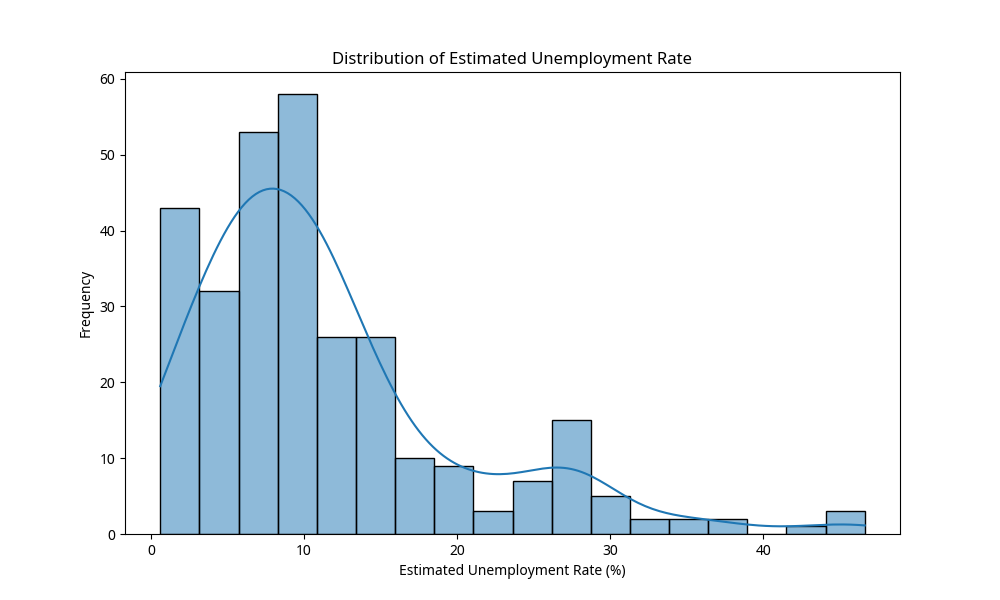
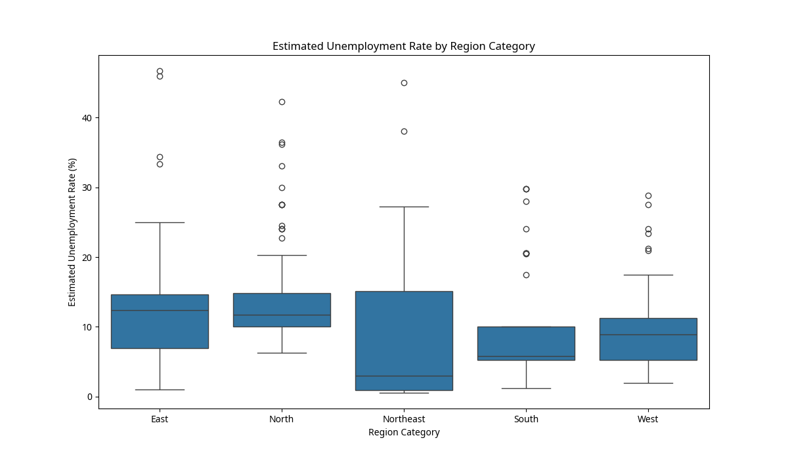
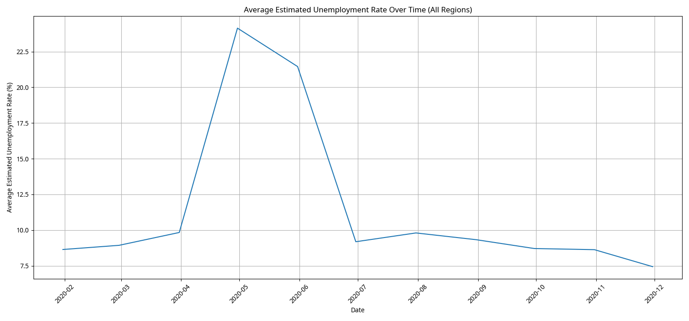
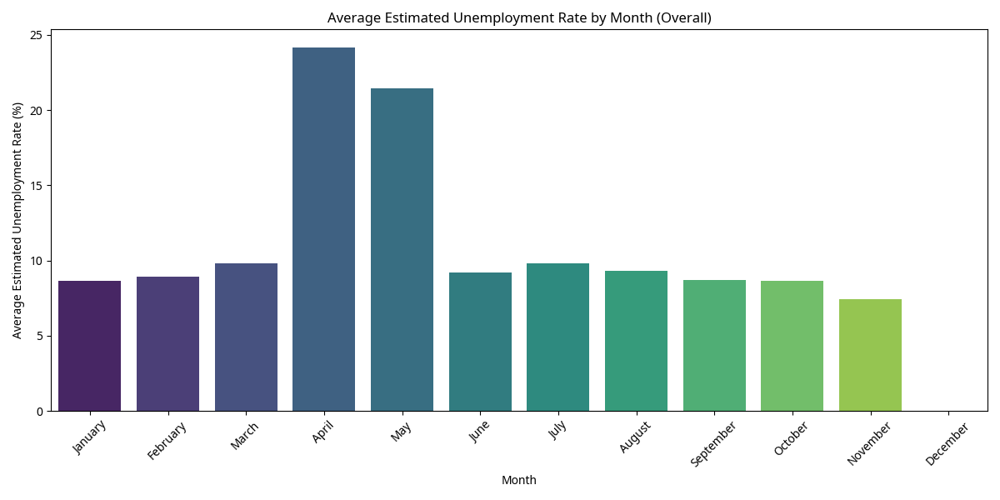
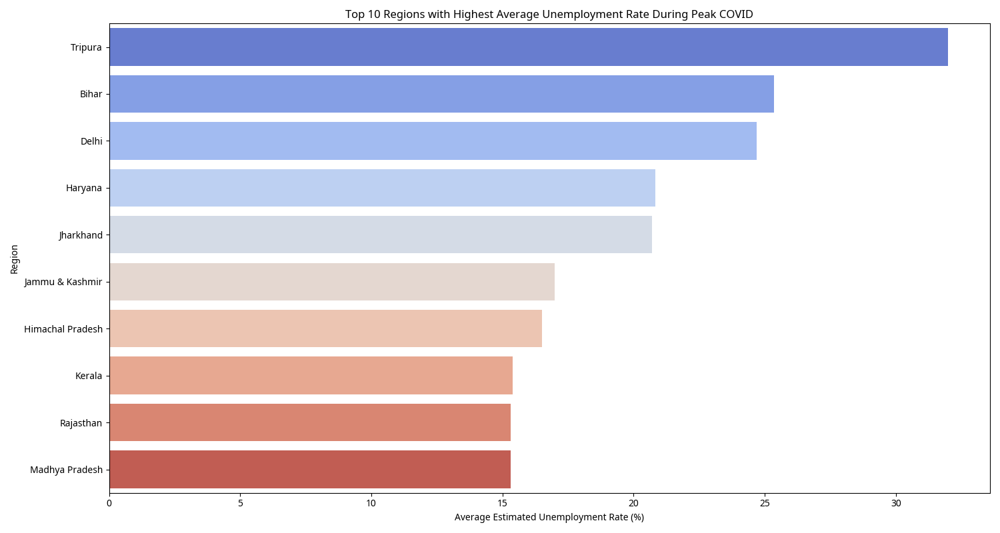
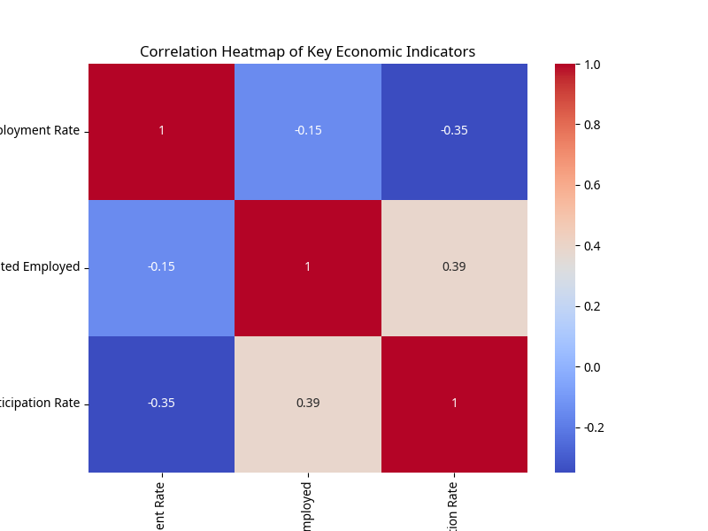

# Unemployment Analysis Report in India and COVID-19 Impact

## Introduction

This report presents an in-depth analysis of unemployment data in India, with a particular focus on the impact of the COVID-19 pandemic. The objective is to identify key trends, regional variations, and the influence of the pandemic on unemployment rates, in order to provide relevant information for the development of economic and social policies.

## Data Overview

The dataset used for this analysis contains information on the estimated unemployment rate, estimated number of employed individuals, and labor participation rate for different regions of India, from January to November 2020. It also includes geographical coordinates for each region.

**Key dataset columns:**
- `Region`: State or territory of India.
- `Date`: Monthly record date.
- `Frequency`: Data collection frequency (monthly).
- `Estimated Unemployment Rate`: Estimated unemployment rate in percentage.
- `Estimated Employed`: Estimated number of employed individuals.
- `Estimated Labour Participation Rate`: Estimated labor participation rate.
- `Region_Category`: Regional category (East, North, Northeast, South, West).
- `longitude`, `latitude`: Geographical coordinates of the region.

## Methodology

The analysis was conducted in several stages:

1.  **Data Cleaning and Preparation**: Data types were adjusted (e.g., the 'Date' column was converted to datetime format) and columns were renamed for better readability. No missing values were detected.
2.  **Exploratory Data Analysis (EDA)**: Descriptive statistics were generated and the distribution of the unemployment rate was visualized.
3.  **Data Visualization**: Various graphs were created to explore unemployment trends by region and over time.
4.  **COVID-19 Impact Analysis**: Comparison of unemployment rates before, during, and after the peak of the pandemic.
5.  **Trend Identification**: Analysis of monthly and regional unemployment trends.

## Results and Insights

### 1. Distribution of Unemployment Rate

The distribution of the estimated unemployment rate shows a concentration around 5-15%, with some higher peaks, particularly during the COVID-19 lockdown period. This indicates significant variability in unemployment rates across regions and periods.

### 2. Unemployment Rate by Region Category

Analysis by region category reveals disparities. Some regions, like the Northeast, appear to have generally lower unemployment rates, while others, like the East and North, show greater variability and higher extreme values.

### 3. Average Unemployment Rate Over Time (All Regions)

The graph below illustrates the evolution of the average unemployment rate aggregated across all regions. A drastic increase in unemployment is observed around April-May 2020, coinciding with strict lockdown measures imposed in India. The rate then gradually decreases but remains higher than pre-pandemic levels towards the end of the year.

### 4. Monthly Unemployment Trends

Monthly analysis of the average unemployment rate confirms the peak in April and May 2020. This highlights the seasonal or event-driven nature of certain fluctuations, strongly influenced by the pandemic.

### 5. COVID-19 Impact: Pre-COVID, Peak, and Post-Peak Comparison

Average unemployment rates by region category confirm the significant impact of COVID-19:

-   **Pre-COVID (Jan-Feb 2020)**: Relatively stable and low rates.
-   **During Peak COVID (Mar-Aug 2020)**: Notable increase in rates across all regions, with regions like East and North showing the largest increases.
-   **Post-Peak COVID (Sep-Nov 2020)**: A slight improvement, but rates remain high compared to the pre-COVID period, indicating a slow recovery.

### 6. Top 10 Most Affected Regions during COVID Peak

This graph highlights the regions that experienced the highest unemployment rates during the peak period of the pandemic. Tripura, Bihar, and Delhi are among the most severely affected regions, underscoring the need for targeted interventions in these areas.

### 7. Correlation Heatmap

The correlation heatmap between the unemployment rate, the number of employed individuals, and the labor participation rate reveals important relationships. A negative correlation is observed between the unemployment rate and the number of employed, which is expected. The relationship with the labor participation rate is also interesting and warrants further exploration.

## Conclusion and Policy Implications

Unemployment analysis in India in 2020 clearly highlights the devastating impact of the COVID-19 pandemic on the labor market. The peak unemployment in April-May 2020 is a direct consequence of lockdown measures, disproportionately affecting certain regions.

**Policy Implications:**

-   **Targeted Support**: The most affected regions (such as Tripura, Bihar, Delhi) require targeted employment support programs and economic aid to accelerate their recovery.
-   **Labor Market Flexibility**: The speed of recovery in some regions suggests the importance of flexibility and adaptability of businesses and workers.
-   **Continuous Monitoring**: Continuous monitoring of labor market indicators is crucial to anticipate future shocks and adjust policies accordingly.
-   **Economic Diversification**: Encouraging economic diversification in regions heavily dependent on vulnerable sectors could strengthen their resilience to crises.

This report provides a basis for understanding unemployment dynamics during a crisis and emphasizes the importance of a data-driven approach to effective policy-making.

